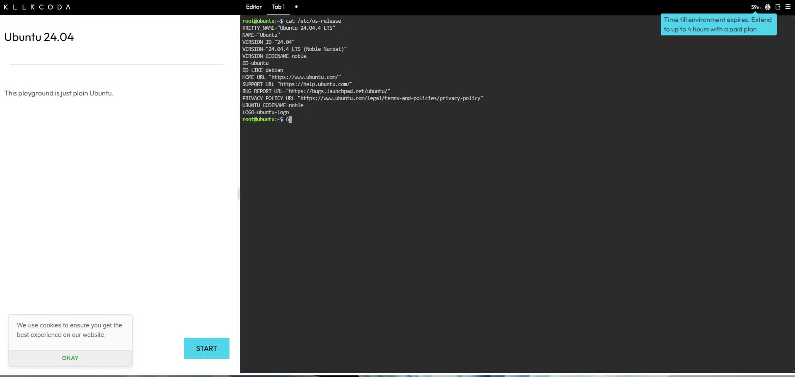
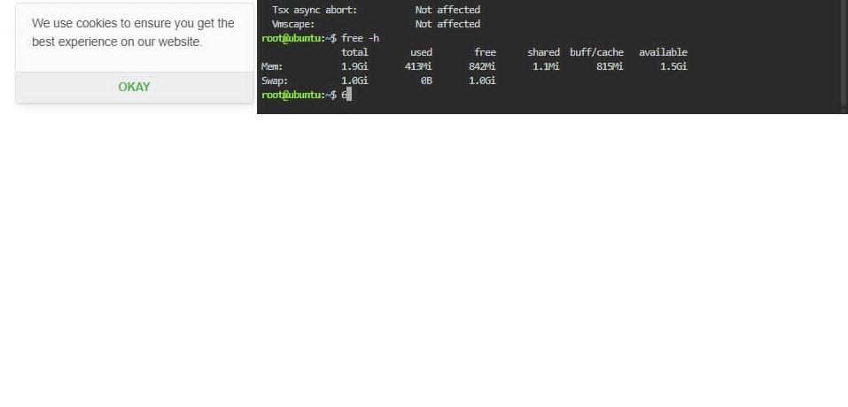

# Laboratory 03 – Multi-Cloud Explorer

## Checkpoint 7 – Continue Your Linux Investigation

### Linux Server Information

I launched a KillerCoda Playground and used Linux commands to identify the system information of the Ubuntu server.

### 1. Operating System

The Linux server is running **Ubuntu 24.04.4 LTS**.

### 2. CPU Information

The server has **1 virtual CPU (CPU)**. The processor information shown is an **Intel Xeon E5-series processor running at approximately 2.40 GHz**.

### 3. Memory

The server has approximately **1.9 GiB of total memory** available.

### 4. Disk Space

The main filesystem has approximately **19 GiB of total disk space**, with approximately **5.4 GiB available**.

## Cloud Hosting Options

If this Linux server were migrated to the cloud, it could be hosted using virtual machine services from the three major cloud providers:

| Cloud Provider        | Service                |
| --------------------- | ---------------------- |
| AWS                   | Amazon EC2             |
| Microsoft Azure       | Azure Virtual Machines |
| Google Cloud Platform | Google Compute Engine  |

**AWS:** Amazon EC2 could host the Ubuntu Linux server as a virtual machine. The server could be configured with suitable CPU, memory, and storage resources.

**Microsoft Azure:** Azure Virtual Machines could host the Ubuntu Linux server. An appropriate Linux-compatible virtual machine size could be selected based on the server's resource requirements.

**Google Cloud Platform:** Google Compute Engine could host the Ubuntu Linux server as a virtual machine. The required CPU, memory, and disk resources could be configured according to the workload.

### Conclusion

The KillerCoda investigation demonstrated how Linux system information such as the operating system, CPU, memory, and disk space can be used when planning a cloud migration. AWS EC2, Azure Virtual Machines, and Google Compute Engine all provide suitable virtual machine services for hosting an Ubuntu Linux server.

