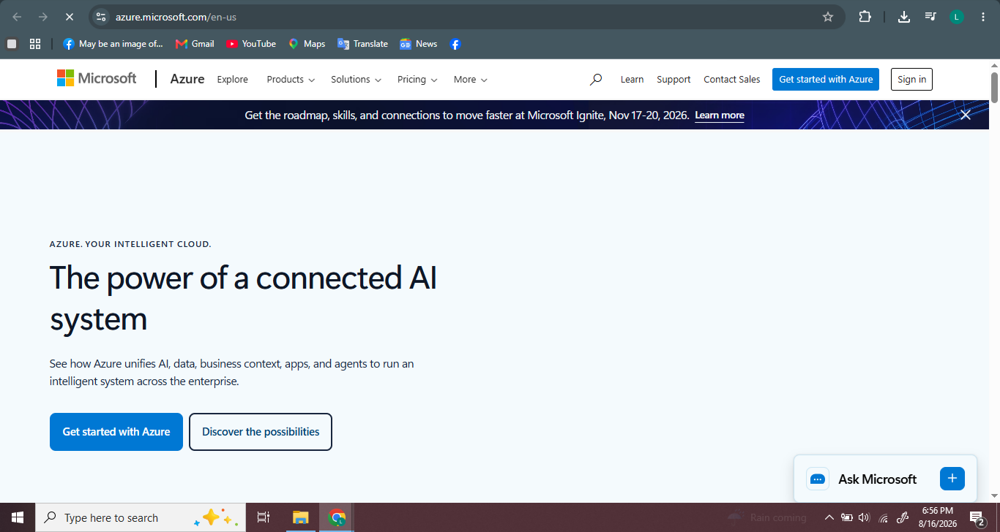

# Azure Research

## 1. Brief Overview

Microsoft Azure is a cloud computing platform from Microsoft. It provides cloud services that organizations can use for computing, storage, networking, databases, and other IT needs.

## 2. Global Infrastructure

Azure has a global infrastructure made up of regions and data centers around the world. This allows organizations to deploy applications and services closer to their users.

## 3. Cloud Management Console

The Azure portal is a web-based management tool. It allows users to create, configure, monitor, and manage Azure resources and services.

## 4. Four Core Services

1. Azure Virtual Machines – provides virtual computers for running applications.
2. Azure Blob Storage – stores files and other unstructured data.
3. Azure Virtual Network – provides networking for Azure resources.
4. Microsoft Entra ID – manages users, identities, and access.

## 5. Three Advantages

1. Azure works well with Microsoft products and technologies.
2. Azure can scale resources based on business needs.
3. Azure provides many cloud services for organizations.

## 6. Typical Enterprise Use Cases

Azure can be used for web applications, virtual machines, databases, data storage, backup, networking, and enterprise applications.

## 7. Screenshot

