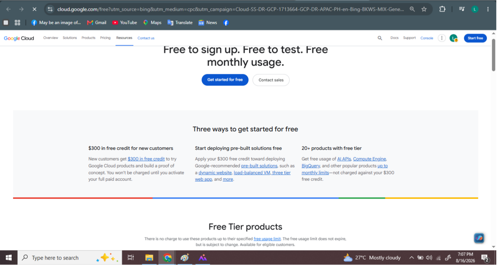

# GCP Research

## 1. Brief Overview

Google Cloud Platform (GCP) is a cloud computing platform from Google. It provides cloud services for computing, storage, networking, databases, artificial intelligence, and other IT needs.

## 2. Global Infrastructure

GCP has a global infrastructure made up of regions and zones. These allow organizations to deploy applications and services in different geographic locations.

## 3. Cloud Management Console

Google Cloud Console is a web-based management tool used to create, configure, monitor, and manage Google Cloud resources.

## 4. Four Core Services

1. Compute Engine – provides virtual machines for running applications.
2. Cloud Storage – provides object storage for files and data.
3. Virtual Private Cloud (VPC) – provides networking for cloud resources.
4. Cloud Identity – provides identity and access management.

## 5. Three Advantages

1. GCP provides strong data and computing capabilities.
2. GCP supports artificial intelligence and machine learning services.
3. GCP provides strong support for Kubernetes and container-based applications.

## 6. Typical Enterprise Use Cases

GCP can be used for web applications, data analytics, artificial intelligence, machine learning, databases, storage, and containerized applications.

## 7. Screenshot

